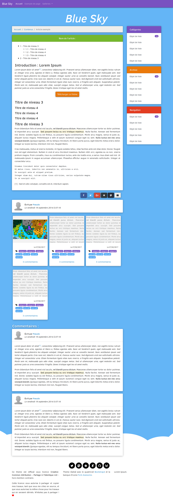

# Theme-Bluesky

Un nouveau petit thème en HTML5 et en CSS, basé sur Bootstrap, fait par votre serviteur :D Il s'agit d'un simple petit thème inspiré du Material Design, mais en tentant d'y ajouter une touche de 3D par l'utilisation d'ombres sur les éléments solides (boutons, panels), ainsi qu'un aspect "incrusté" aux textes dans les boutons et dans les panneaux.

J'ai tenté de faire un petit fond minimaliste avec un ciel et des nuages en bas, avec l'idée que les nuages ferait la transition avec une zone en bas qui sert ici pour mes crédits, mais on peut également imaginer mettre trois colonnes pour avoir un footer plus complexe :)

Ce theme se base sur du pur bootstrap, et n'utilise pas de theme bootstrap Material :)

## Crédits :

- Theme par Kazhnuz
- Propulsé par Bootstrap3 et [ForkAwesome](https://forkawesome.github.io/)

Le theme BlueSky est sous licence GPL version 3 :)

## Screenshot

